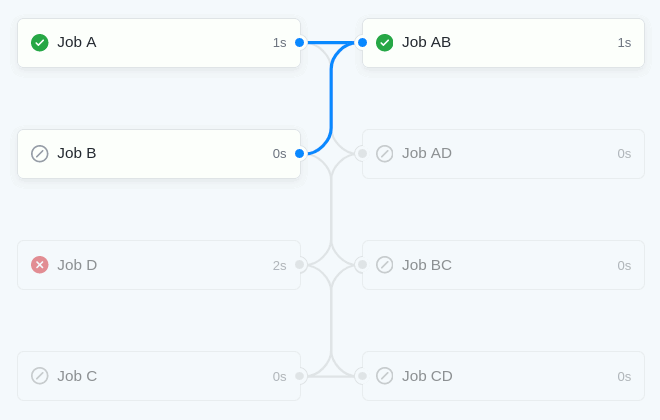
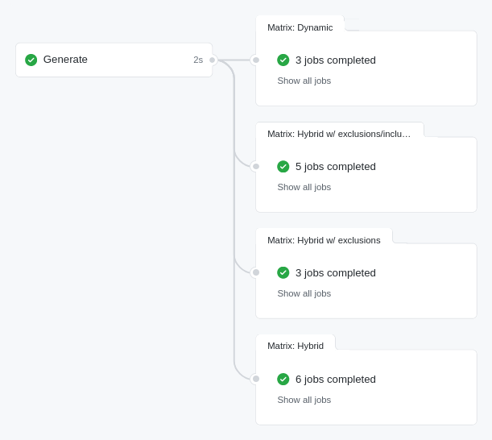

# Github workflow patterns

## Why?
I recently noticed that a sizeable number of questions asked on Github Community and StackOverflow, are not related the specifics of workflows but the design and structure of workflows. It is understandable. Despite the high quality documentation provided, most of the power and possibilities of Github workflows are left to the users to discover. I am by no mean the authority on Github workflows. My aim here is to regroup patterns that I have used or seen, in their simplest form, in the hope that it might help somebody out there. If you have any question, suggestion, additional pattern you would like see in here, feel free to contact me via issues or PR.

## Patterns
Following is a list of patterns. All this pattern have been implemented in actual workflows [here](.github/workflows). Feel free to go through the file and runs on this repository. I tried to keep the workflow as simple as possible, using actions strictly when needed. These are by no mean best practices or recommended ways to write workflows, simply patterns that I have encountered.

### One job to N jobs
N jobs wait on a single Job to succeed before proceeding. This might be use to build an artifact before running different tests on it. Ensuring, in this way, that all the tests are run on the exact same artifact.

[Example](.github/workflows/1-to-n.yml)

### N jobs to one jobs
In this case a single job is waiting on multiple jobs to succeed. One such pattern could be use to build separate parts of a single application in parallel before merging all the bits into a single artifact and eventually publish it. This is illustrated in the Matrix aggregation bellow.

[Example](.github/workflows/n-to-1.yml)

### Matrix aggregation
An extension of the previous N to 1 pattern is what we could call an aggregation.
In this pattern, each job from a matrix generate an artifact. A single job waits 
for the completion of the whole matrix, before retrieving all the artifacts.

[Example](.github/workflows/aggregation.yml)

### Ignore skipped dependencies
So times, it might be useful to run a job even if some of its dependencies have been skipped. Some of its dependencies might, for example, only run on specific branches or when tags are pushed. In an other hand, this job still needs to fail if any of the dependencies failed.

[Example](.github/workflows/ignore-skipped.yml)

### Dynamic matrices
When creating matrices of jobs, multiple instances of the same job with different parameters or settings, it is not always possible to hardcoded all the different instances. For example, you might want to run all your different tests suites in parallel without having to update your workflow every time a new suite is added. In this pattern, a job is executed before your matrix and will generate the list of items, or in this case test suites, before passing it the matrix. You will see in the following examples that this can be combined with standard, hardcoded way, in what I call hybrid matrices.

[Example](.github/workflows/dynamic-matrices.yml)

